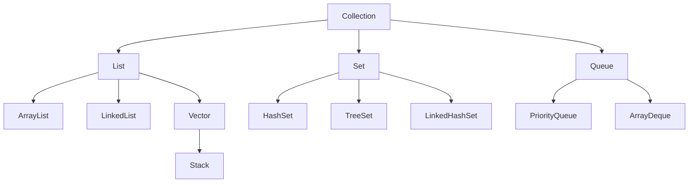

# Java Collections Framework: A Comprehensive Guide

*Published on April 14, 2024*

## Overview

This guide provides a comprehensive overview of the Java Collections Framework, a fundamental part of the Java programming language. The Collections Framework provides a unified architecture for representing and manipulating collections of objects. It includes interfaces, implementations, and algorithms that make it easier to work with groups of objects efficiently and effectively. This guide covers everything from basic collection types to advanced operations and best practices.

## Table of Contents

1. [What is the Collections Framework?](#what-is-the-collections-framework)
2. [Collections Hierarchy](#collections-hierarchy)
3. [Main Collection Interfaces](#main-collection-interfaces)
4. [Map Interface](#map-interface)
5. [Common Operations](#common-operations)
6. [Advanced Features](#advanced-features)
7. [Best Practices](#best-practices)
8. [Performance Characteristics](#performance-characteristics)
9. [Common Use Cases](#common-use-cases)
10. [References](#references)

## What is the Collections Framework?

The Java Collections Framework is a unified architecture for representing and manipulating collections. It provides:

- Interfaces that define different types of collections
- Implementations of these interfaces
- Algorithms for manipulating collections
- Utility classes for common operations

### Key Benefits:
- Reduces programming effort
- Increases program speed and quality
- Allows interoperability among unrelated APIs
- Reduces effort to learn and use new APIs
- Reduces effort to design new APIs
- Fosters software reuse

### Core Components:
- Collection Interfaces
- Collection Implementations
- Collection Algorithms
- Collection Utilities

## Collections Hierarchy



### Text-based Hierarchy Representation

```
Collection
├── List
│   ├── ArrayList
│   ├── LinkedList
│   └── Vector
│       └── Stack
├── Set
│   ├── HashSet
│   ├── TreeSet
│   └── LinkedHashSet
└── Queue
    ├── PriorityQueue
    └── ArrayDeque
```

## Main Collection Interfaces

### 1. List Interface
Lists are ordered collections that allow duplicate elements.

#### ArrayList Example
```java
List<String> fruits = new ArrayList<>();
fruits.add("Apple");
fruits.add("Banana");
fruits.add("Orange");
System.out.println(fruits); // [Apple, Banana, Orange]
```

#### LinkedList Example
```java
List<Integer> numbers = new LinkedList<>();
numbers.add(1);
numbers.add(2);
numbers.add(3);
System.out.println(numbers); // [1, 2, 3]
```

### 2. Set Interface
Sets are collections that do not allow duplicate elements.

#### HashSet Example
```java
Set<String> uniqueNames = new HashSet<>();
uniqueNames.add("John");
uniqueNames.add("Jane");
uniqueNames.add("John"); // Duplicate, won't be added
System.out.println(uniqueNames); // [John, Jane]
```

#### TreeSet Example
```java
Set<Integer> sortedNumbers = new TreeSet<>();
sortedNumbers.add(5);
sortedNumbers.add(2);
sortedNumbers.add(8);
System.out.println(sortedNumbers); // [2, 5, 8]
```

### 3. Queue Interface
Queues are collections designed for holding elements prior to processing.

#### PriorityQueue Example
```java
Queue<Integer> priorityQueue = new PriorityQueue<>();
priorityQueue.add(5);
priorityQueue.add(1);
priorityQueue.add(3);
System.out.println(priorityQueue.poll()); // 1
System.out.println(priorityQueue.poll()); // 3
```

#### ArrayDeque Example
```java
Deque<String> deque = new ArrayDeque<>();
deque.addFirst("First");
deque.addLast("Last");
System.out.println(deque); // [First, Last]
```

## Map Interface
Maps store key-value pairs and are not part of the Collection interface but are part of the Collections Framework.

### HashMap Example
```java
Map<String, Integer> ageMap = new HashMap<>();
ageMap.put("John", 25);
ageMap.put("Jane", 30);
System.out.println(ageMap.get("John")); // 25
```

### TreeMap Example
```java
Map<String, Integer> sortedMap = new TreeMap<>();
sortedMap.put("Zebra", 1);
sortedMap.put("Apple", 2);
sortedMap.put("Banana", 3);
System.out.println(sortedMap); // {Apple=2, Banana=3, Zebra=1}
```

## Common Operations

### Iterating through Collections
```java
List<String> names = new ArrayList<>();
names.add("John");
names.add("Jane");

// Using for-each loop
for (String name : names) {
    System.out.println(name);
}

// Using Iterator
Iterator<String> iterator = names.iterator();
while (iterator.hasNext()) {
    System.out.println(iterator.next());
}
```

### Sorting Collections
```java
List<Integer> numbers = new ArrayList<>();
numbers.add(5);
numbers.add(2);
numbers.add(8);

// Natural ordering
Collections.sort(numbers);
System.out.println(numbers); // [2, 5, 8]

// Custom sorting
Collections.sort(numbers, Collections.reverseOrder());
System.out.println(numbers); // [8, 5, 2]
```

## Advanced Features

### 1. Stream API Integration
```java
List<String> names = Arrays.asList("John", "Jane", "Jack");
List<String> filteredNames = names.stream()
    .filter(name -> name.startsWith("J"))
    .collect(Collectors.toList());
```

### 2. Concurrent Collections
```java
Map<String, Integer> concurrentMap = new ConcurrentHashMap<>();
concurrentMap.put("key", 1);
```

### 3. Collections Utility Methods
```java
List<Integer> numbers = Arrays.asList(1, 2, 3, 4, 5);
Collections.shuffle(numbers);
Collections.reverse(numbers);
```

## Best Practices

1. **Collection Selection**:
   - Use `ArrayList` for fast random access and infrequent modifications
   - Use `LinkedList` for frequent additions/removals
   - Use `HashSet` for general-purpose sets
   - Use `TreeSet` for sorted elements
   - Use `HashMap` for general-purpose maps
   - Use `TreeMap` for sorted keys

2. **Memory Management**:
   - Initialize collections with appropriate capacity
   - Use immutable collections when possible
   - Clear collections when no longer needed
   - Consider using weak references for caches

3. **Thread Safety**:
   - Use concurrent collections for multi-threaded access
   - Consider synchronization when needed
   - Use immutable collections for thread safety
   - Document thread safety requirements

4. **Performance Optimization**:
   - Choose appropriate collection types
   - Use bulk operations when possible
   - Consider memory usage
   - Profile collection operations

## Performance Characteristics

| Collection | Add/Remove | Get | Contains | Next |
|------------|------------|-----|----------|------|
| ArrayList | O(n) | O(1) | O(n) | O(1) |
| LinkedList | O(1) | O(n) | O(n) | O(1) |
| HashSet | O(1) | O(1) | O(1) | O(h/n) |
| TreeSet | O(log n) | O(log n) | O(log n) | O(log n) |
| HashMap | O(1) | O(1) | O(1) | O(h/n) |
| TreeMap | O(log n) | O(log n) | O(log n) | O(log n) |

## Common Use Cases

1. **Data Storage**:
   - Storing user data
   - Caching results
   - Managing application state
   - Storing configuration

2. **Data Processing**:
   - Filtering data
   - Sorting collections
   - Transforming data
   - Aggregating results

3. **Algorithm Implementation**:
   - Graph algorithms
   - Search algorithms
   - Sorting algorithms
   - Data structures

4. **System Integration**:
   - API responses
   - Database results
   - File processing
   - Network communication

## References

- [Java Collections Framework Documentation](https://docs.oracle.com/javase/8/docs/technotes/guides/collections/overview.html)
- [Java Collections Tutorial](https://docs.oracle.com/javase/tutorial/collections/)
- [Java Collections Best Practices](https://www.baeldung.com/java-collections)
- [Java Collections Performance](https://www.baeldung.com/java-collections-complexity)
- [Java Collections API Guide](https://docs.oracle.com/javase/8/docs/api/java/util/Collection.html)
