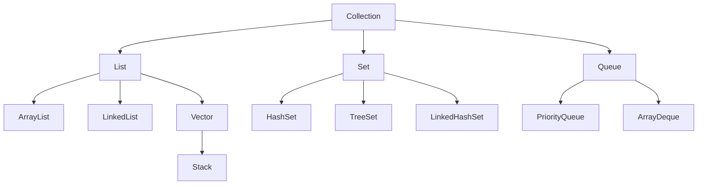

# Java Collections Framework

*Published on April 14, 2024*

The Java Collections Framework is a unified architecture for representing and manipulating collections. It provides a set of interfaces, implementations, and algorithms to work with groups of objects.

## Collections Hierarchy



### Text-based Hierarchy Representation

```
Collection
├── List
│   ├── ArrayList
│   ├── LinkedList
│   └── Vector
│       └── Stack
├── Set
│   ├── HashSet
│   ├── TreeSet
│   └── LinkedHashSet
└── Queue
    ├── PriorityQueue
    └── ArrayDeque
```

## Main Collection Interfaces

### 1. List Interface
Lists are ordered collections that allow duplicate elements.

#### ArrayList Example
```java
List<String> fruits = new ArrayList<>();
fruits.add("Apple");
fruits.add("Banana");
fruits.add("Orange");
System.out.println(fruits); // [Apple, Banana, Orange]
```

#### LinkedList Example
```java
List<Integer> numbers = new LinkedList<>();
numbers.add(1);
numbers.add(2);
numbers.add(3);
System.out.println(numbers); // [1, 2, 3]
```

### 2. Set Interface
Sets are collections that do not allow duplicate elements.

#### HashSet Example
```java
Set<String> uniqueNames = new HashSet<>();
uniqueNames.add("John");
uniqueNames.add("Jane");
uniqueNames.add("John"); // Duplicate, won't be added
System.out.println(uniqueNames); // [John, Jane]
```

#### TreeSet Example
```java
Set<Integer> sortedNumbers = new TreeSet<>();
sortedNumbers.add(5);
sortedNumbers.add(2);
sortedNumbers.add(8);
System.out.println(sortedNumbers); // [2, 5, 8]
```

### 3. Queue Interface
Queues are collections designed for holding elements prior to processing.

#### PriorityQueue Example
```java
Queue<Integer> priorityQueue = new PriorityQueue<>();
priorityQueue.add(5);
priorityQueue.add(1);
priorityQueue.add(3);
System.out.println(priorityQueue.poll()); // 1
System.out.println(priorityQueue.poll()); // 3
```

#### ArrayDeque Example
```java
Deque<String> deque = new ArrayDeque<>();
deque.addFirst("First");
deque.addLast("Last");
System.out.println(deque); // [First, Last]
```

## Map Interface
Maps store key-value pairs and are not part of the Collection interface but are part of the Collections Framework.

### HashMap Example
```java
Map<String, Integer> ageMap = new HashMap<>();
ageMap.put("John", 25);
ageMap.put("Jane", 30);
System.out.println(ageMap.get("John")); // 25
```

### TreeMap Example
```java
Map<String, Integer> sortedMap = new TreeMap<>();
sortedMap.put("Zebra", 1);
sortedMap.put("Apple", 2);
sortedMap.put("Banana", 3);
System.out.println(sortedMap); // {Apple=2, Banana=3, Zebra=1}
```

## Common Operations

### Iterating through Collections
```java
List<String> names = new ArrayList<>();
names.add("John");
names.add("Jane");

// Using for-each loop
for (String name : names) {
    System.out.println(name);
}

// Using Iterator
Iterator<String> iterator = names.iterator();
while (iterator.hasNext()) {
    System.out.println(iterator.next());
}
```

### Sorting Collections
```java
List<Integer> numbers = new ArrayList<>();
numbers.add(5);
numbers.add(2);
numbers.add(8);

// Natural ordering
Collections.sort(numbers);
System.out.println(numbers); // [2, 5, 8]

// Custom sorting
Collections.sort(numbers, Collections.reverseOrder());
System.out.println(numbers); // [8, 5, 2]
```

## Best Practices

1. Use `ArrayList` when you need fast random access and don't need to frequently add/remove elements
2. Use `LinkedList` when you need frequent additions/removals from the middle of the list
3. Use `HashSet` for general-purpose sets with no ordering requirements
4. Use `TreeSet` when you need sorted elements
5. Use `HashMap` for general-purpose key-value storage
6. Use `TreeMap` when you need sorted keys
7. Use `PriorityQueue` when you need to process elements based on priority

## Performance Characteristics

| Collection | Add/Remove | Get | Contains | Next |
|------------|------------|-----|----------|------|
| ArrayList | O(n) | O(1) | O(n) | O(1) |
| LinkedList | O(1) | O(n) | O(n) | O(1) |
| HashSet | O(1) | O(1) | O(1) | O(h/n) |
| TreeSet | O(log n) | O(log n) | O(log n) | O(log n) |
| HashMap | O(1) | O(1) | O(1) | O(h/n) |
| TreeMap | O(log n) | O(log n) | O(log n) | O(log n) |
